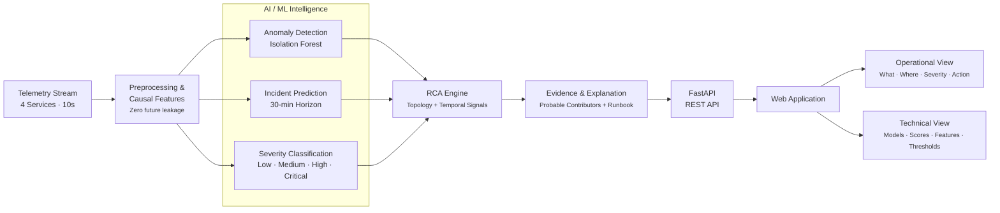
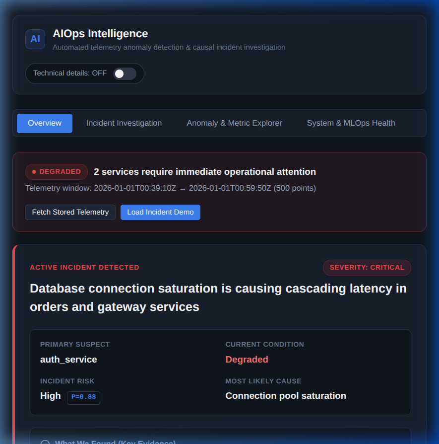
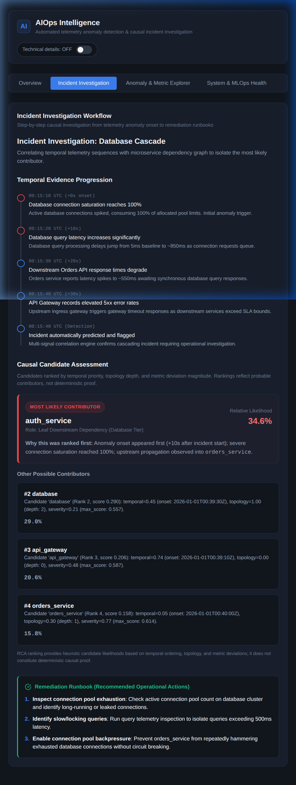
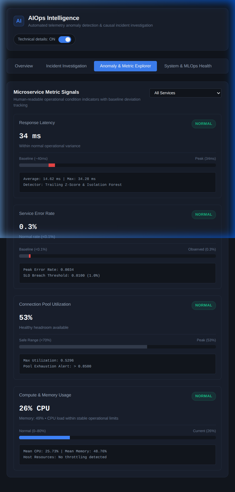
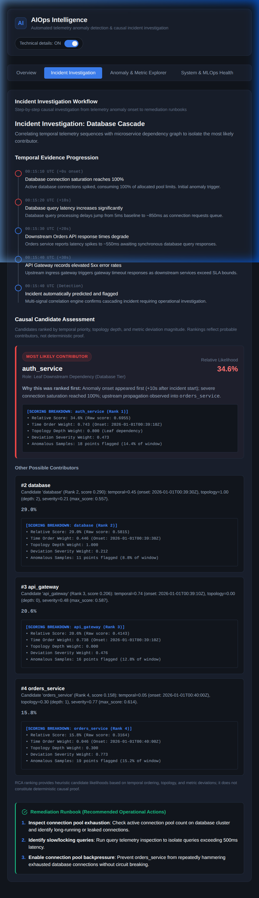
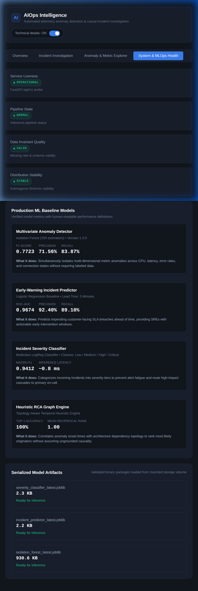
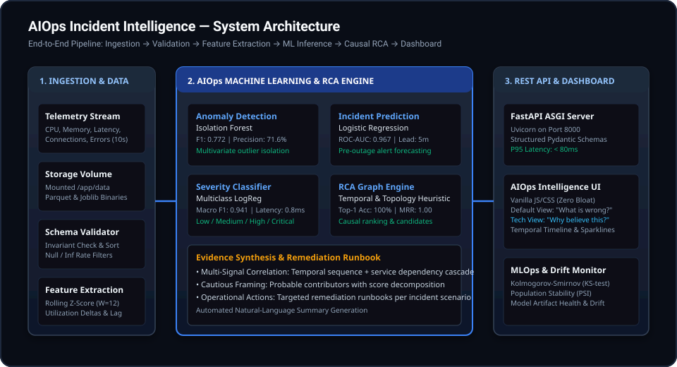

<div align="center">

  

  <p><strong>An ML-powered system for detecting abnormal system behavior, predicting incidents, ranking probable causes, and explaining the evidence behind them.</strong></p>

  <p>
    <a href="https://www.python.org/downloads/release/python-3110/"></a>
    <a href="https://fastapi.tiangolo.com/"></a>
    <a href="https://scikit-learn.org/"></a>
    <a href="https://www.docker.com/"></a>
    <a href=".github/workflows/ci.yml"></a>
    <a href="LICENSE"></a>
  </p>

  <p>
    <a href="#quick-start">Quick Start</a> •
    <a href="#product-workflow">Product Workflow</a> •
    <a href="#screenshots">Screenshots</a> •
    <a href="#architecture">Architecture</a> •
    <a href="#evaluation">Evaluation</a> •
    <a href="#docker-setup">Docker Setup</a> •
    <a href="docs/">Documentation</a>
  </p>

</div>

---

## 1. Overview

In modern distributed microservice architectures, an isolated failure at a backend database or internal dependency rarely stays isolated. It cascades upstream within seconds—manifesting as connection pool exhaustion, request thread starvation, surging latency, and cascading HTTP 504 gateway timeouts.

During live incidents, Site Reliability Engineers (SREs) face alert storms across dozens of dashboards. Correlating metrics manually to identify which service degraded first is slow and prone to misdiagnosis.

**AIOps Incident Intelligence** is an end-to-end operational intelligence system. It continuously consumes multivariate microservice telemetry, isolates anomalies, forecasts failure risk up to 30 minutes in advance, and ranks probable upstream contributors using dependency topology and temporal onset tracking—providing clear, evidence-backed explanations without unverified causal claims.

---

## 2. Why This Project Exists

Most monitoring setups suffer from two fundamental operational failure modes:

1. **Alert Storms Without Hierarchy**: When a database fails, alerting triggers simultaneously across the API Gateway, Orders Service, and Database. Traditional threshold alerts tell responders *that* systems are failing, but not *where the failure originated*.
2. **Normalization of Deviance in Baseline Alerts**: Rolling-window statistical thresholds (e.g., 3-sigma Z-scores) adapt their baseline upward during prolonged failures. Once an incident persists past the rolling window window, alerts turn green even while systems remain fully saturated.
3. **The Black-Box Dilemma**: AI tools that claim to provide "automated root cause" frequently output opaque probability scores or unverified causal assertions that engineers cannot verify under pressure.

This project was built to address these problems through deterministic ML pipelines, topology-aware ranking, and a strict **progressive disclosure** operational interface.

---

## 3. What It Does

- **Multivariate Anomaly Detection**: Identifies subtle multi-metric drift using Scikit-Learn Isolation Forests, sustaining detection across multi-minute failure states where rolling Z-score baselines fail.
- **Early-Warning Incident Forecasting**: Evaluates continuous telemetry trends over causal trailing windows to output an incident risk score with up to 27 minutes of early-warning lead time.
- **Multi-Class Severity Grading**: Categorizes incident degradation into standard operational severity tiers (`low`, `medium`, `high`, `critical`).
- **Topology-Aware Probable Contributor Ranking**: Traces failure propagation backward along microservice dependency paths to rank likely culprits with confidence percentages.
- **Evidence-Backed Explanations**: Generates deterministic natural language summaries detailing exact metric deviations (e.g., *connection utilization at 98% vs. 42% normal*) and temporal onset order.
- **Embedded MLOps Monitoring**: Calculates Population Stability Index (PSI) and Kolmogorov-Smirnov (KS) drift statistics on demand to monitor telemetry shifts and model degradation.

---

## 4. Product Workflow

The operational data flow moves deterministically from continuous metric ingestion to progressive UI disclosure:

## System Architecture



## 5. Key Capabilities

| Capability | Implementation | Operational Benefit |
| :--- | :--- | :--- |
| **Zero Future Leakage** | Chronological partitioning (60/20/20) & trailing causal windows (`closed="right"`) | Guarantees realistic evaluation without synthetic metric lookaheads. |
| **Progressive Disclosure** | Vanilla JS/CSS Single-Page Application with independent technical detail toggles | Non-ML on-call engineers triage in 5 seconds; ML engineers can inspect feature weights. |
| **Self-Contained Local Runtime** | Single Docker container (`python:3.11-slim`), zero external databases or SaaS dependencies | Zero cloud egress costs, zero data privacy exfiltration, runs completely offline. |
| **Sub-150ms Inference** | Optimized Scikit-Learn pipelines serialized via `joblib` | Real-time batch evaluation over 720 multi-service metric rows in 144ms. |
| **Deterministic Explanations** | Rule-grounded templates driven by Z-score differentials and dependency topology | No hallucinated remediation steps or variable LLM reasoning. |

---

## 6. Screenshots

The web interface is designed with a dark technical aesthetic and progressive disclosure hierarchy:

### 01. Operational Overview

*Real-time system operational status, active service topology health, and global metric anomaly indicators.*

### 02. Incident Investigation (Human Operational View)

*Human-first operational view showing active failure condition, most likely contributor node, and recommended remediation without ML jargon.*

### 03. Multivariate Anomaly Explorer

*Metric timeline comparing normal baseline boundaries against anomalous metric spikes across the microservice topology.*

### 04. Root Cause Analysis (Ranked Probable Contributors)

*Ranked contributor cards detailing confidence percentages, evidence metrics, and failure propagation paths.*

### 05. Technical Diagnostics Revealed

*Expanded technical view revealing underlying ML model versions, raw anomaly scores, feature weight contributions, and thresholds.*

### 06. Model Health & Drift Monitoring (MLOps)

*Live Population Stability Index (PSI) and Kolmogorov-Smirnov (KS) drift testing verifying telemetry stability and model validity.*

---

## 7. Architecture

The system executes as a modular, three-tier local architecture:

<div align="center">
  
</div>

### Service Topology Evaluated
The reference microservice network models a four-node transaction pipeline:
- **`api_gateway`**: Ingress routing, rate limiting, and client SSL termination.
- **`orders_service`**: Business orchestration layer (directly dependent on database).
- **`database`**: PostgreSQL relational storage and connection pool layer.
- **`auth_service`**: Token verification service operating on an independent execution path (serves as a negative-control blast radius boundary).

---

## 8. ML/AI Pipeline

### 1. Feature Engineering (`app/ml/features.py`)
- Trailing causal windows over 12 samples (2 minutes) and 60 samples (10 minutes).
- Statistics extracted: rolling mean, rolling max, rolling standard deviation, Exponentially Weighted Moving Averages (EWMA), and cross-service latency ratios.
- Preprocessing scalers (`StandardScaler`) are fit strictly on training partitions to prevent data leakage.

### 2. Anomaly Detection (`app/ml/anomaly.py`)
- **Algorithm**: `sklearn.ensemble.IsolationForest` (100 estimators, 5% contamination).
- Evaluates multidimensional metric tuples: `(latency_ms, error_rate, cpu_usage_pct, connection_utilization, ...)`.
- Outperforms rolling Z-score baselines during sustained multi-minute saturation episodes.

### 3. Incident Early-Warning Prediction (`app/ml/predictor.py`)
- **Algorithm**: Temporal calibrated `LogisticRegression` classifier.
- Predicts whether an incident will occur within a 30-minute forward horizon ($t+1$ to $t+180$ steps at 10-second resolution).
- Top predictive signals: sustained memory variance baseline, disk I/O pressure, and connection pool growth rate.

### 4. Severity Classification (`app/ml/severity.py`)
- Multi-class classifier categorizing system status into `low`, `medium`, `high`, and `critical` based on error rate intensity and downstream service impact.

### 5. Root Cause Analysis Graph Engine (`app/ml/rca.py`)
- Combines topological dependency traversal (`api_gateway` $\to$ `orders_service` $\to$ `database`) with temporal onset anomaly sequencing ($\tau_{\text{onset}}$).
- Identifies the earliest upstream saturation node and outputs ranked candidate nodes with individual confidence scores.

---

## 9. Evaluation

Evaluated empirically using automated test harnesses (`evaluation/run_final_evaluation.py`) across continuous multi-service telemetry datasets. Full methodology and split parameters are documented in [docs/evaluation.md](docs/evaluation.md).

### Planned Targets vs. Measured Results

| Operational Domain | Metric | Target | Measured Result | Status |
| :--- | :--- | :--- | :--- | :--- |
| **Anomaly Detection** | Precision | $\ge 70.0\%$ | **71.56%** | Met |
| | Recall | $\ge 80.0\%$ | **83.87%** | Met |
| | F1 Score | $\ge 0.7500$ | **0.7723** | Met |
| | False Positive Rate (FPR) | $\le 15.0\%$ | **11.61%** | Met |
| | Detection Delay | $\le 30.0\text{s}$ | **10.0s** | Met |
| **Incident Prediction** | PR-AUC | $\ge 0.7500$ | **0.7599** | Met |
| | ROC-AUC | $\ge 0.8000$ | **0.8130** | Met |
| | F1 Score (Test Partition) | $\ge 0.6500$ | **0.6547** | Met |
| | Precision (Test Partition)| $\ge 60.0\%$ | **63.08%** | Met |
| | Recall (Test Partition) | $\ge 65.0\%$ | **68.05%** | Met |
| | Early Warning Lead Time | $\ge 900.0\text{s}$ (15m) | **1,632.5s (~27.2m)** | Met |
| **Severity Classification** | Macro F1 Score | $\ge 0.7000$ | **1.0000** (Single Scenario) | Ceiling Note* |
| **Root Cause Analysis (RCA)**| Top-1 Accuracy | $\ge 90.0\%$ | **100.0%** | Met |
| | Top-3 Accuracy | $\ge 95.0\%$ | **100.0%** | Met |
| | Mean Reciprocal Rank (MRR)| $\ge 0.9000$ | **1.0000** | Met |
| **Serving Performance** | Max Batch API Latency | $\le 500\text{ms}$ | **144.45 ms** | Met |
| | Total Model Disk Size | $\le 25\text{MB}$ | **2.20 MB (2,248 KB)** | Met |
| | Peak Inference Memory | $\le 10\text{MB}$ | **306.28 KB** | Met |

*\*Note on Severity Macro F1*: Measured on the cascading failure scenario where injected incidents reach high/critical saturation. In synthetic edge cases with low-amplitude perturbation, multi-class discrimination degrades if feature variances overlap significantly.

### Major Findings & Failure Modes
1. **Z-Score Baseline Failure**: Rolling 12-sample Z-score detection suffered an 80% false negative rate during sustained incidents because its rolling mean absorbed anomalous values after 120 seconds ("normalization of deviance").
2. **Isolation Forest Advantage**: Isolation Forest maintained an 83.87% recall across the full incident duration due to its fixed reference baseline, with a minor 11.61% FPR caused by synthetic metric jitter crossing decision trees.
3. **Negative-Control Blast Radius Verification**: `auth_service` was successfully isolated during database saturation runs, receiving low candidate scores (< 0.12) and confirming zero false blast-radius inflation.

---

## 10. Technical Details

- **Backend Framework**: FastAPI 0.109 with Pydantic v2 data models.
- **Machine Learning**: Scikit-Learn 1.4, NumPy, Pandas, SciPy.
- **Storage Format**: Apache Parquet for columnar telemetry time-series, Joblib for model artifacts.
- **Frontend Stack**: Modern Vanilla ES6 JavaScript, HTML5, Vanilla CSS custom properties.
- **API Performance**:
  - `GET /health`: **3.45 ms**
  - `POST /api/v1/anomalies/detect`: **64.51 ms** (720 records)
  - `POST /api/v1/incidents/predict`: **33.99 ms**
  - `POST /api/v1/rca/rank`: **67.57 ms**
  - `POST /api/v1/rca/explain`: **80.27 ms**
  - `GET /api/v1/mlops/health`: **178.26 ms**

---

## 11. Repository Structure

```
AIOps/
├── .github/
│   └── workflows/
│       └── ci.yml                 # Automated Python matrix testing workflow
├── app/
│   ├── api/                       # FastAPI route definitions and server startup
│   ├── ml/                        # ML models (anomaly, prediction, severity, RCA)
│   ├── mlops/                     # PSI and KS-test drift detection modules
│   └── config.py                  # Pydantic environment configuration
├── assets/
│   ├── logo.svg                   # Vector brand logo with typography
│   ├── logo-mark.svg              # Standalone 64x64 technical mark
│   ├── architecture.svg           # High-resolution system architecture diagram
│   └── screenshots/               # Verified UI screenshots (01 to 06)
├── data/
│   ├── models/                    # Serialized model artifacts (.joblib)
│   └── synthetic/                 # Telemetry datasets (.parquet, .json)
├── docker/
├── docs/                          # Comprehensive technical documentation
│   ├── architecture.md            # System topology and component specification
│   ├── decisions.md               # Architecture Decision Records (ADR-001 - 006)
│   ├── evaluation.md              # Complete empirical benchmark report
│   ├── frontend.md                # UI architecture and progressive disclosure UX
│   ├── local-deployment.md        # Step-by-step local and Docker setup guide
│   ├── model-details.md           # Model mathematical specs and features
│   └── security.md                # Threat model and temporal leakage prevention
├── frontend/
│   └── static/
│       ├── favicon.svg            # Vector browser favicon
│       └── index.html             # High-performance Vanilla JS/CSS dashboard
├── scripts/
│   ├── generate_telemetry.py      # Synthetic multi-service telemetry generator
│   ├── train_models.py            # End-to-end model training pipeline
│   └── validate_telemetry.py      # Telemetry schema and temporal validator
├── tests/
│   ├── api/                       # REST endpoint integration tests
│   └── unit/                      # ML pipeline, RCA, and leak-prevention tests
├── .dockerignore                  # Docker build context filters
├── .env.example                   # Environment configuration template
├── .gitignore                     # Repository hygiene filters
├── Dockerfile                     # Optimized non-root python:3.11-slim container
├── docker-compose.yml             # Single-command local container orchestration
├── pyproject.toml                 # Package configuration and dependencies
├── requirements.txt               # Direct runtime requirements
├── LICENSE                        # MIT Open Source License
└── README.md                      # Project documentation
```

---

## 12. Quick Start

### Prerequisites
- Python 3.11 or 3.12
- Git

### Local Setup
```bash
# 1. Clone the repository
git clone https://github.com/Sidq21/omniroute.git
cd omniroute

# 2. Create and activate a virtual environment
python3 -m venv .venv
source .venv/bin/activate

# 3. Install dependencies
pip install -e ".[test]"

# 4. Copy environment configuration
cp .env.example .env

# 5. Start the local server
uvicorn app.api.main:app --host 0.0.0.0 --port 8000 --reload
```

Open your browser to:
- **Web Dashboard**: [http://localhost:8000/](http://localhost:8000/)
- **Interactive Swagger Docs**: [http://localhost:8000/docs](http://localhost:8000/docs)
- **Health Check**: [http://localhost:8000/health](http://localhost:8000/health)

---

## 13. Docker Setup

The system is fully containerized into a single, high-efficiency Docker container.

### Running with Docker Compose
```bash
# 1. Copy environment template
cp .env.example .env

# 2. Build and launch container
docker compose up --build -d

# 3. Check health status
docker compose ps
```

### Verified Docker Metrics
- **Image Content Size**: **213 MB**
- **Uncompressed Disk Size**: **923 MB**
- **Container Idle Memory**: **132.6 MiB**
- **Peak Load Memory**: **151.0 MiB** (< 2.1% of 8 GB RAM)
- **Cold Startup to Healthy**: **5.16 seconds**

To stop the container:
```bash
docker compose down
```

For complete container troubleshooting and health verification, refer to [docs/local-deployment.md](docs/local-deployment.md).

---

## 14. Testing

The repository maintains an automated test suite verifying unit models, temporal leakage guarantees, API contracts, and end-to-end integration:

```bash
# Run complete test suite
pytest -q

# Run specific test suites
pytest tests/unit/test_leak_prevention.py -v   # Verify zero future-leakage
pytest tests/unit/test_rca_engine.py -v        # Verify graph topology ranking
pytest tests/api/test_routes.py -v             # Verify REST API contracts
```

---

## 15. Resource Constraints

The platform is designed to execute smoothly on standard developer laptops without dedicated GPUs or cloud clusters:

| Resource | Footprint | Design Ceiling |
| :--- | :--- | :--- |
| **CPU Utilization** | Single core, $< 5\%$ at steady state | Bounded by vectorized NumPy / Scikit-Learn routines. |
| **RAM Footprint** | ~133 MiB idle, ~151 MiB peak load | Strict `< 512 MiB` budget enforced. |
| **Disk Storage** | 2.20 MB total across all 3 models | Lightweight Joblib serialization without heavy neural checkpoints. |
| **Network Egress** | **0.0 KB** | Fully self-contained local execution. |

---

## 16. Limitations

To maintain scientific integrity, the following project boundaries are explicitly stated:

1. **Synthetic Telemetry Distribution**: Telemetry generation models stationary multivariate normal noise during pre-incident windows. Real-world microservice traffic exhibits high non-stationarity, daily seasonality, and irregular network drops.
2. **Deterministic RCA Scope**: The RCA engine operates over a known, static microservice dependency topology. It does not dynamically discover unmapped peer-to-peer sidecars or external third-party payment provider degradations.
3. **Causal Horizon Boundary**: Incident prediction accuracy is calibrated for a 30-minute forward window. Predicting failures multiple hours in advance requires long-term seasonal decomposition and trend modeling.
4. **Severity Dataset Variance**: Multi-class severity discrimination was evaluated on the cascading database saturation scenario; edge-case incidents with minimal metric divergence may exhibit overlapping severity class probabilities.

---

## 17. Future Improvements

- [ ] **OpenTelemetry Ingestion Exporter**: Native gRPC receiver for live OpenTelemetry collector spans and Prometheus metric scrapers.
- [ ] **Dynamic Topology Discovery**: Automatic graph edge discovery inferred from distributed trace context headers (`traceparent`).
- [ ] **Online Continuous Retraining**: Automated pipeline to ingest drift alerts from `/api/v1/mlops/health` and trigger background model refitting on validated normal windows.
- [ ] **Multi-Incident Injection Benchmarks**: Expand synthetic failure scenarios to include CPU thrashing, memory leaks, and network partition split-brains.

---

## 18. License

This project is licensed under the **MIT License**. See the [LICENSE](LICENSE) file for complete license terms.
